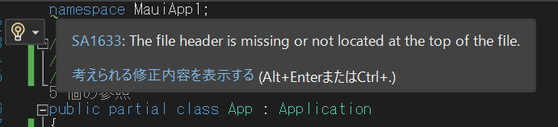
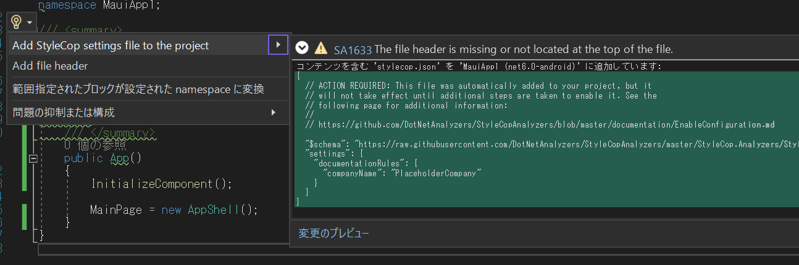
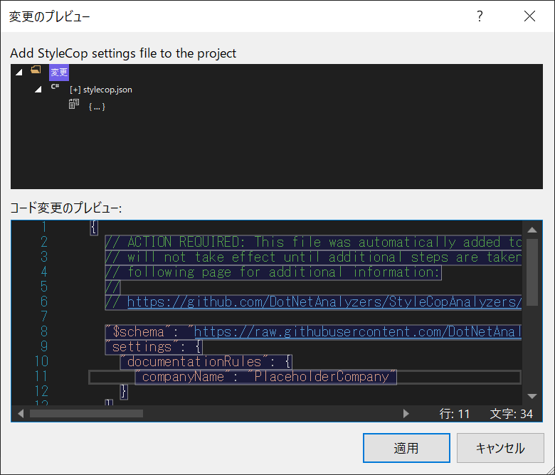
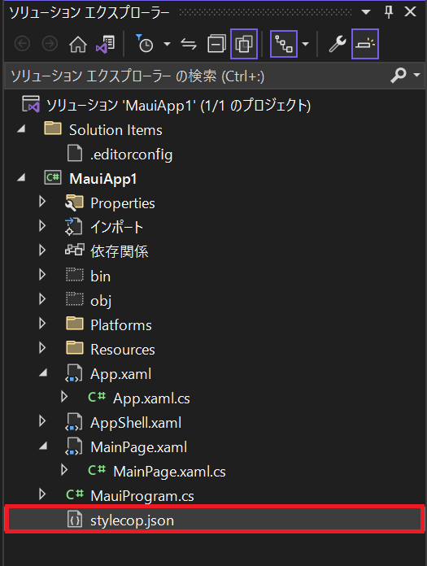
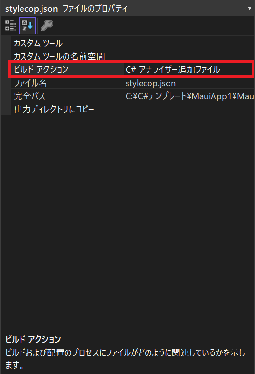
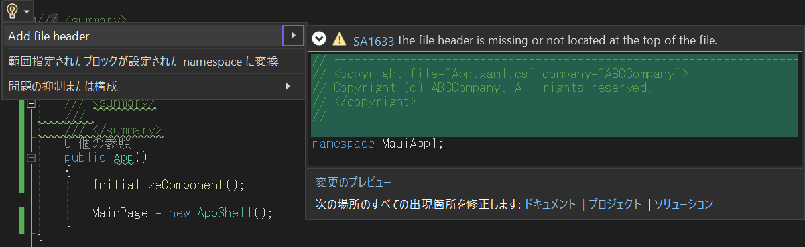
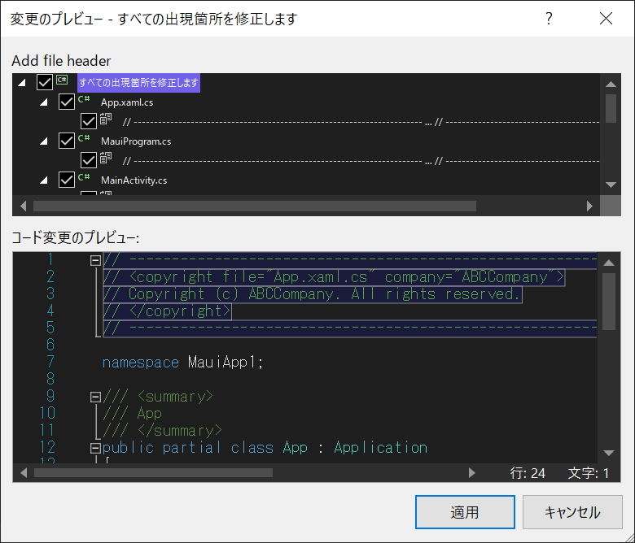
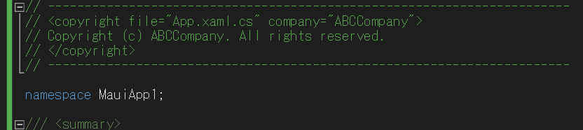

## C#のソースファイルにファイルヘッダを付ける場合

1. ソースファイルの１行目にカーソルを合わせると「SA1633」の警告が表示されます。

2. 「考えられる修正内容を表示する」をクリックします。
3. 「Add StyleCop setting file to the project」にカーソルを合わせ「変更のプレビュー」をクリックします。 <br/>「適用」をクリックします。

4. ソリューションにjsonファイル「stylecop.json」が追加されます。
<br />

5. 「stylecop.json」を編集します。 
 ```json
{
  // ACTION REQUIRED: This file was automatically added to your project, but it
  // will not take effect until additional steps are taken to enable it. See the
  // following page for additional information:
  //
  // https://github.com/DotNetAnalyzers/StyleCopAnalyzers/blob/master/documentation/EnableConfiguration.md
 "$schema":"https://raw.githubusercontent.com/DotNetAnalyzers/StyleCopAnalyzers/master/StyleCop.Analyzers/StyleCop.Analyzers/Settings/stylecop.schema.json",
  "settings": {
    "documentationRules": {
      "companyName": "ABCCompany",
		  "copyrightText": "Copyright (c) {companyName}. All rights reserved.",
      "headerDecoration": "-----------------------------------------------------------------------"
    }
  }
}
```

6. 「stylecop.json」のプロパティの項目「ビルドアクション」を「C# アナライザー追加ファイル」を選択します。<br />
7. もう一度ソースファイルの１行目にカーソルを合わせて「Add file header」にカーソルを合わせてヘッダファイルの内容を確認します。期待通りであれば「ソリューション」をクリックし変更のプレビュー「適用」をクリックします。
8. ヘッダが表示されることを確認します。



